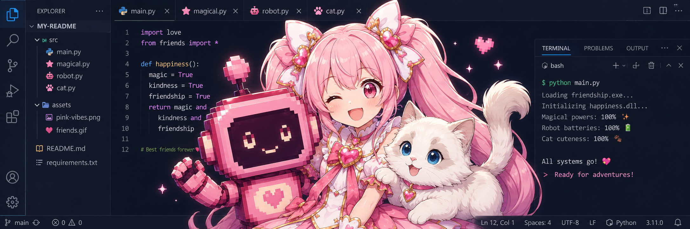

# sub-cat

<p align="center">
  
</p>

<p align="center"><em>바탕화면에 사는 작은 펫 — 냥냥이 · 마법소녀 · 로봇</em></p>

OpenAI 비전 API로 사용자의 화면을 보고 짧게 말을 거는 투명 데스크톱 캐릭터입니다.

## 캐릭터

- **냥냥이** — 흰 크림 장모, 큰 푸른 눈. 옆에 사뿐히 앉아 조용하고 다정하게 말하는 고양이.
- **마법소녀** — 분홍빛 마력과 리본·별 장식. 씩씩하고 자신감 있는 응원 톤의 변신 히어로.
- **로봇** — 작은 펫 로봇. 짧고 효율적인 보고체로 말하되 사용자를 챙기는 따뜻함은 유지.

> **Windows 전용.** 화면 캡처와 투명 항상-위 창이 Windows API에 의존합니다.

## 시작

```powershell
pip install -r requirements.txt
python main.py
```

OpenAI API 키는 실행 후 우클릭 → `설정 > OpenAI API 키 설정...` 으로 입력하면 자동 저장됩니다.

## 조작

- **더블 클릭** — 대화 열기
- **왼쪽 드래그** — 이동
- **우클릭** — 메뉴 (캐릭터 선택 / 이름 바꾸기 / 설정 / 장난 / 종료)

## 장난

캐릭터가 메모장에 글자를 치거나, 화면을 잠깐 RGB 분리·반전시키는 등 작은 장난을 칠 수 있습니다. 우클릭 → `설정 > 장난 허용` 체크박스로 언제든 끌 수 있고, 끈 상태는 다음 실행에도 유지됩니다.

## 설정 저장 위치

이름·API 키·캐릭터 선택·장난 허용 여부는 `%APPDATA%\sub-cat\config.json` 에 저장되어 다음 실행에도 유지됩니다.

## 개인정보

메시지를 보낼 때마다 현재 화면이 캡처되어 OpenAI로 전송됩니다. 민감한 화면 위에서는 대화를 보내지 마세요. 채팅창 하단에도 같은 안내가 표시됩니다.

## License

[MIT](LICENSE)
