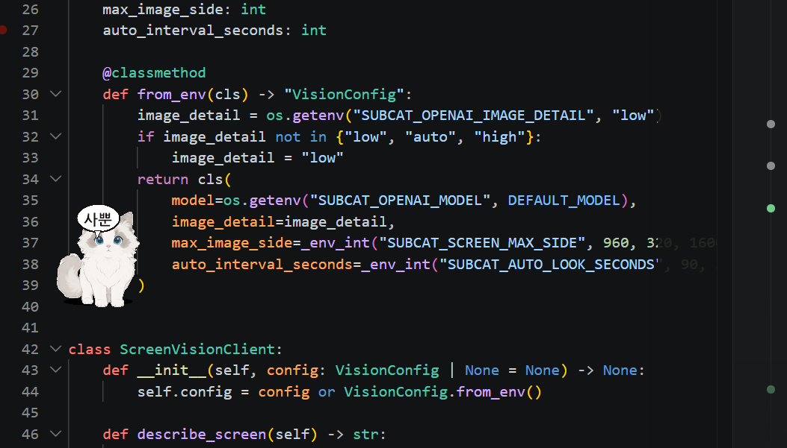

# sub-cat

<p align="center">
  
</p>

<p align="center"><em>사뿐… 바탕화면을 순찰하는 보스 고양이 <strong>밍</strong></em></p>

> **플랫폼: Windows 전용.** 화면 캡처(`ctypes` + GDI), 투명 항상-위 창(`-transparentcolor`), 장난 기능(`pywin32`, `pyautogui`) 모두 Windows API에 의존합니다. macOS/Linux에서 실행하면 캡처 시 `RuntimeError`가 발생하고 일부 기능이 비활성화됩니다.

바탕화면을 순찰하는 근육질 보스 고양이 에이전트 **밍**을 만드는 프로젝트입니다.

현재 버전은 Python `tkinter`로 투명한 항상-위 창을 만들고, OpenAI API를 연결하면 사용자가 말을 걸 때만 밍이 바탕화면을 보고 거친 말투로 답합니다. 화면 캡처는 Windows 기본 API로 처리하고, 이미지는 OpenAI Responses API에 전송됩니다.

## 설치

```powershell
pip install -r requirements.txt
```

OpenAI API를 쓰려면 실행 전에 API 키를 환경 변수로 설정하세요.

```powershell
$env:OPENAI_API_KEY="YOUR_API_KEY"
```

기본 모델은 `gpt-5.4-mini`입니다. 바꾸고 싶다면 다음처럼 설정할 수 있습니다.

```powershell
$env:SUBCAT_OPENAI_MODEL="gpt-5.5"
```

## 실행

```powershell
python main.py
```

## 조작

- 더블 클릭: 밍과 대화하기
- 왼쪽 클릭 후 드래그: 밍 들어서 옮기기
- 오른쪽 클릭: 메뉴 열기

메뉴에서 `밍 부르기`, `대화하기`, `순찰 모드`, `기절잠`, `고양이 선택`, `이름 바꾸기`, `설정`, `종료`를 선택할 수 있습니다.

### 이름과 API 키를 앱 안에서 바꾸기

- **이름 바꾸기**: 우클릭 → `이름 바꾸기...` 로 새 이름을 입력하면 즉시 창 제목·메뉴·시스템 프롬프트의 자기 인식까지 그 이름으로 바뀝니다. 이름은 `%APPDATA%\sub-cat\config.json` 에 저장되어 다음 실행에도 유지됩니다.
- **OpenAI API 키 설정**: 우클릭 → `설정` → `OpenAI API 키 설정...` 으로 키를 입력하면 같은 `config.json` 에 저장되고 이후 앱 시작 시 자동으로 `OPENAI_API_KEY` 환경 변수에 주입됩니다. 환경 변수가 이미 설정되어 있으면 그쪽이 우선합니다.
- **OpenAI API 키 삭제**: `설정` → `OpenAI API 키 삭제` 로 config.json 에서 키만 지웁니다.

## 고양이 스타일

우클릭 메뉴의 `고양이 선택`에서 밍의 외형과 말투를 바꿀 수 있습니다.

- `보스냥`: 근육질 몸, 스파이크 목줄, 선글라스
- `마법소녀냥`: 핑크 팔레트, 리본, 별 장식
- `섹시냥`: 야한 표현이 아니라 글램하고 도도한 패션 스타일
- `일반냥`: 평범하고 장난기 있는 고양이
- `오드아이냥`: 서로 다른 눈색과 신비로운 말투
- `애용`: 흰 크림 장모, 회색 귀, 큰 푸른 눈, 분홍 코를 가진 조용한 고양이

## 대화 기능

- 밍을 더블클릭하면 대화창이 열립니다.
- 사용자가 먼저 말을 입력하면 그때만 현재 화면을 캡처하고, 밍이 화면과 선택된 고양이 스타일을 참고해서 답합니다.
- 대화 기록은 앱이 켜져 있는 동안만 메모리에 남습니다.
- `SUBCAT_CHAT_HISTORY_TURNS`: 밍이 기억할 최근 대화 턴 수입니다. 기본값은 8입니다.

## 화면 참고 설정

- `SUBCAT_SCREEN_MAX_SIDE`: OpenAI API로 보내기 전에 스크린샷을 줄일 최대 길이입니다. 기본값은 960입니다.
- `SUBCAT_OPENAI_IMAGE_DETAIL`: `low`, `auto`, `high` 중 하나를 설정합니다. 기본값은 비용과 속도를 아끼는 `low`입니다.

스크린샷에는 현재 화면 내용이 포함될 수 있습니다. 밍은 사용자가 대화창에서 메시지를 보낸 경우에만 화면을 캡처합니다. 민감해 보이는 정보를 읽어 말하지 않도록 프롬프트되어 있지만, API 호출 자체는 이미지를 OpenAI로 보내는 작업입니다.

## 다음에 키우기 좋은 기능

- 밍의 이미지 스프라이트 추가
- 작업 표시줄 근처를 더 자연스럽게 걷는 바닥 감지
- 시간대별 감정과 대사
- 간단한 로컬 메모리로 사용자를 기억하는 행동

## 패키징 목표 (Windows `.exe`)

장기 목표는 `python main.py` 실행형이 아니라 더블 클릭으로 동작하는 데스크톱 펫 앱입니다. PyInstaller 기준 산출물 명세:

- **빌드 도구**: `pyinstaller` (`--noconsole --windowed`)
- **단일 실행 파일**: `dist/sub-cat.exe` (one-file 모드, 부팅 약간 느리지만 배포 단순)
- **자산 번들링**: `assets/aeyong/*.png` + `assets/hero.png` 을 `--add-data "assets;assets"` 로 포함하고, 코드에서 [ming.py:18](src/sub_cat/ming.py#L18) 처럼 `__file__` 기반 경로 대신 PyInstaller 의 `sys._MEIPASS` 를 우선 참조하도록 헬퍼 추가
- **아이콘**: `--icon assets/sub_cat.ico` (256x256 .ico, 별도 제작 필요)
- **환경 변수 입력 UI**: `OPENAI_API_KEY` 가 비어 있으면 최초 실행 시 작은 설정창을 띄워 키를 받아 `%APPDATA%\sub-cat\config.json` 에 저장하고 이후 자동 로드
- **트레이 아이콘**: `pystray` 로 시스템 트레이에 상주 → 메뉴에 "밍 부르기 / 대화하기 / 종료". 창이 닫혀도 트레이에 살아 있게
- **자동 시작 (옵션)**: 트레이 메뉴에 "Windows 시작 시 실행" 토글 → `HKCU\Software\Microsoft\Windows\CurrentVersion\Run` 에 등록/해제
- **코드 사이닝**: 장기 과제 (인증서 비용 부담). 우선은 SmartScreen 경고를 README 에 안내

빌드 명령 예시:

```powershell
pip install pyinstaller pystray pillow
pyinstaller --noconsole --windowed --onefile `
    --name sub-cat `
    --icon assets/sub_cat.ico `
    --add-data "assets;assets" `
    main.py
```

## License

MIT License. 자세한 내용은 [LICENSE](LICENSE) 파일 참고.
